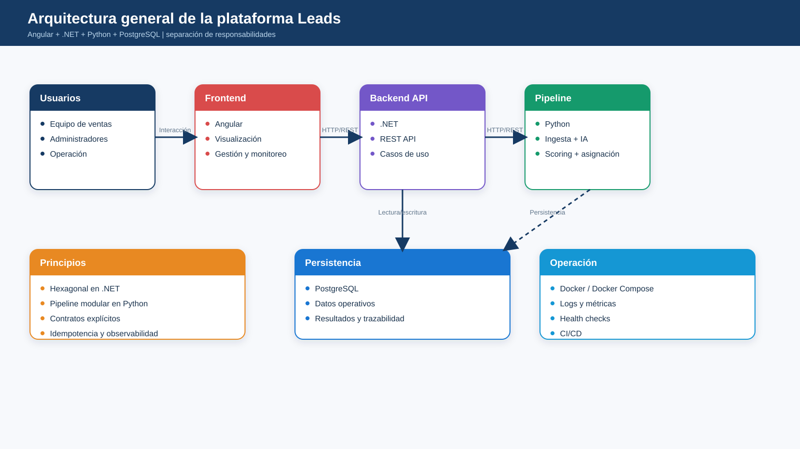
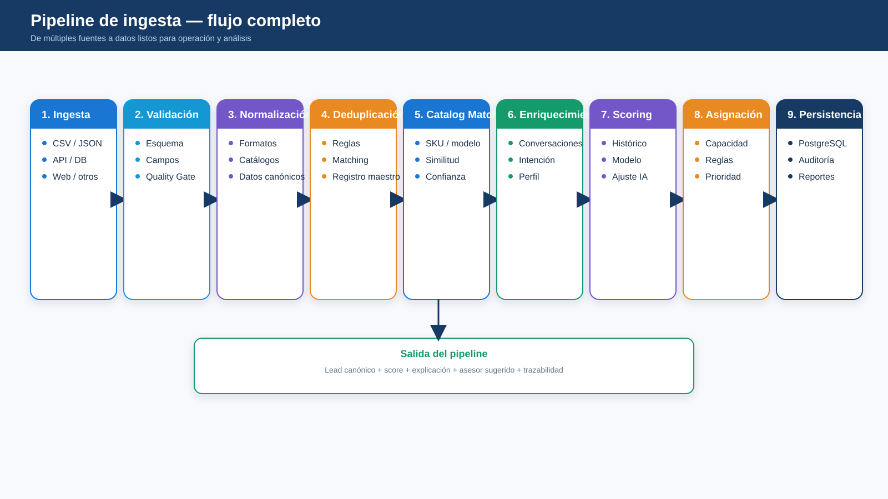
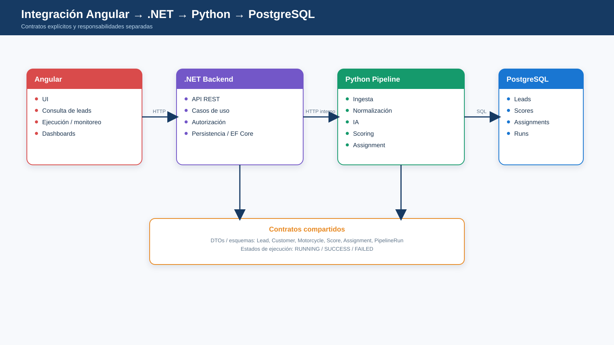

# Arquitectura de solución

## Responsabilidades

| Componente | Responsabilidad |
|---|---|
| Angular | UI, consultas, dashboards y monitoreo |
| .NET | API REST, casos de uso, seguridad, persistencia y contratos |
| Python | Ingesta, calidad, normalización, IA, scoring y asignación |
| PostgreSQL | Persistencia operativa, analítica y trazabilidad |

## Flujo

## Integración

