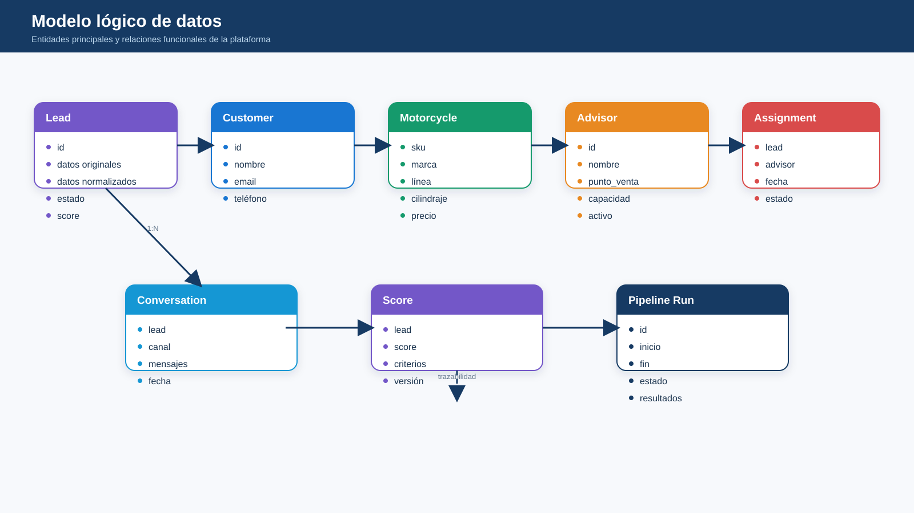

# Datos y persistencia

## Entidades principales

- Lead
- Customer
- Motorcycle
- Advisor
- Assignment
- Conversation
- Score
- Pipeline Run

La implementación productiva debe mantener el esquema de base de datos bajo control de migraciones del backend .NET / EF Core.
