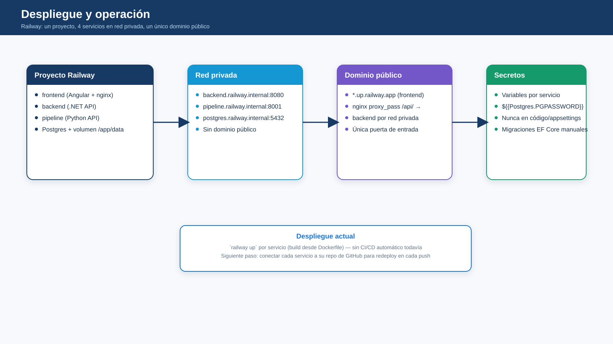

# Despliegue

## Servicios

- Frontend Angular
- Backend .NET
- Pipeline Python
- PostgreSQL
- Nginx opcional

## Ambientes

- Desarrollo
- Staging
- Producción

Las credenciales y claves no deben almacenarse en el repositorio. Los datos reales deben mantenerse fuera del control de versiones salvo que exista una decisión explícita de negocio y de seguridad.
