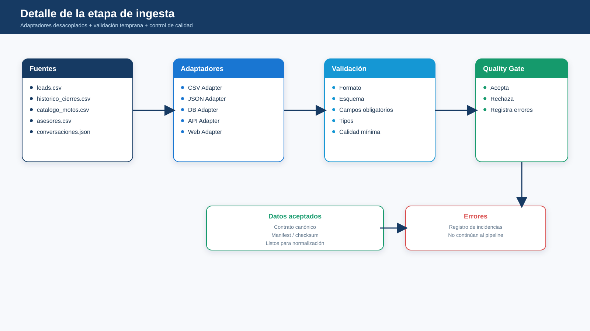
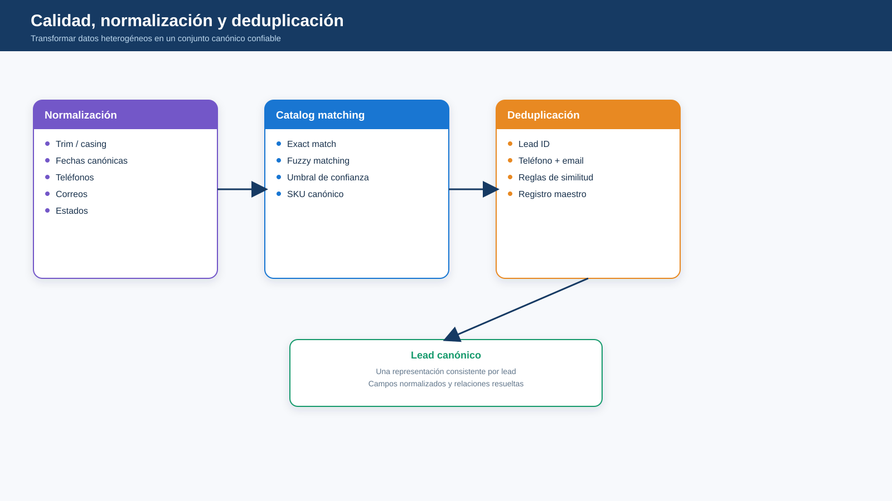
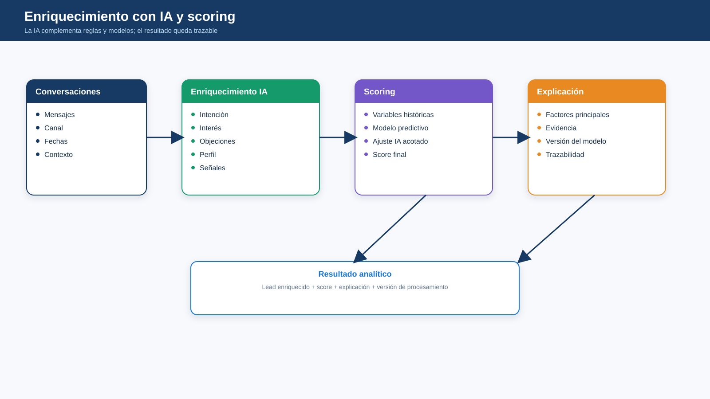
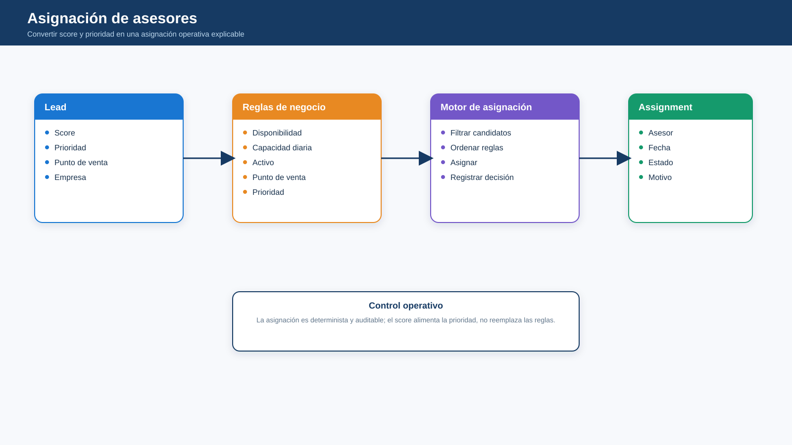

# Pipeline de ingesta y procesamiento

## Etapas

1. Ingesta desde fuentes heterogéneas.
2. Validación de esquema, tipos y campos obligatorios.
3. Normalización a un modelo canónico.
4. Deduplicación y resolución de registros.
5. Matching contra catálogo de motocicletas.
6. Enriquecimiento de conversaciones con IA.
7. Scoring con histórico + señales actuales.
8. Asignación considerando reglas y capacidad.
9. Persistencia y reporting.

